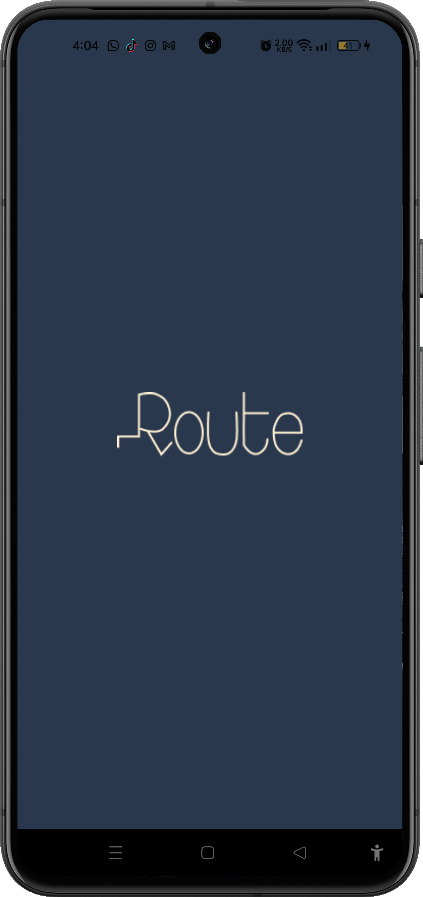
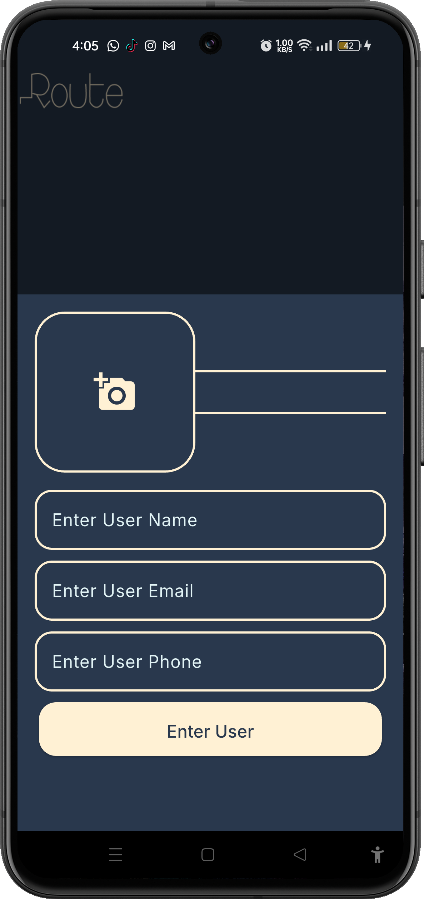
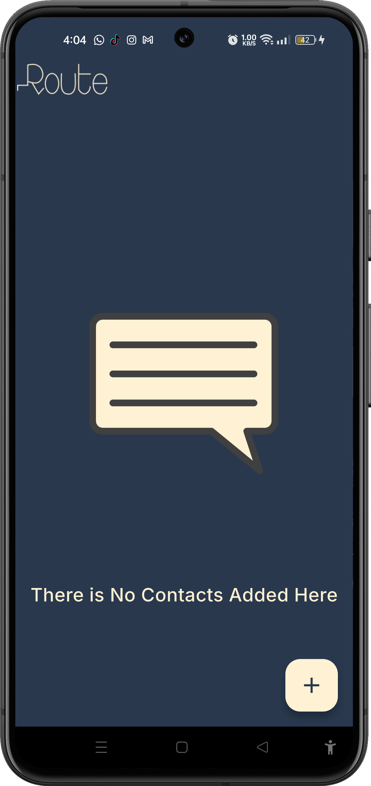

# 📱 Contact App

A simple and clean Flutter application for managing your contacts.

---

## 📌 Description

Contact App lets you easily manage your personal contacts. You can add new contacts with a name, email, phone number, and photo, view them in a grid layout, and delete them when no longer needed.

---

## ✨ Features

- ➕ Add new contacts (name, email, phone, photo)
- 🖼️ Pick a contact photo from your gallery
- 📋 View all contacts in a clean grid layout
- 🗑️ Delete contacts
- 🎬 Animated splash screen
- 📭 Empty state animation when no contacts are added

---

## 🛠 Tech Stack

| Technology | Usage |
|---|---|
| [Flutter](https://flutter.dev/) | UI framework |
| [Dart](https://dart.dev/) | Programming language |
| [google_fonts](https://pub.dev/packages/google_fonts) | Custom fonts |
| [lottie](https://pub.dev/packages/lottie) | Lottie animations |
| [image_picker](https://pub.dev/packages/image_picker) | Pick images from gallery |

> No Firebase or external database — contacts are stored in memory during the session.

---

## 📸 Screenshots

<p float="left">
  
  
  
  
  
  
</p>

---

## ▶️ How to Run

1. **Clone the repository**
   ```bash
   git clone https://github.com/fatmanagaa/contact_app.git
   cd contact_app
   ```

2. **Install dependencies**
   ```bash
   flutter pub get
   ```

3. **Run the app**
   ```bash
   flutter run
   ```

---

## 📝 Notes

- This is a simple practice project built for learning Flutter UI development.
- Contacts are not persisted — they reset when the app is closed.
